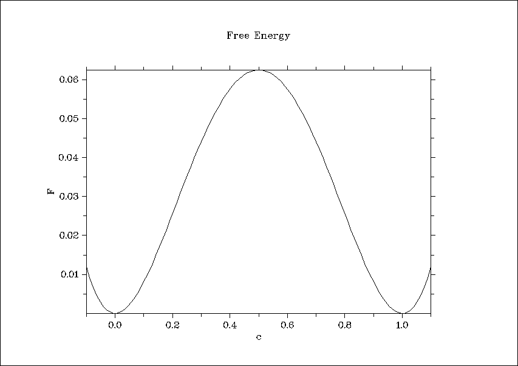
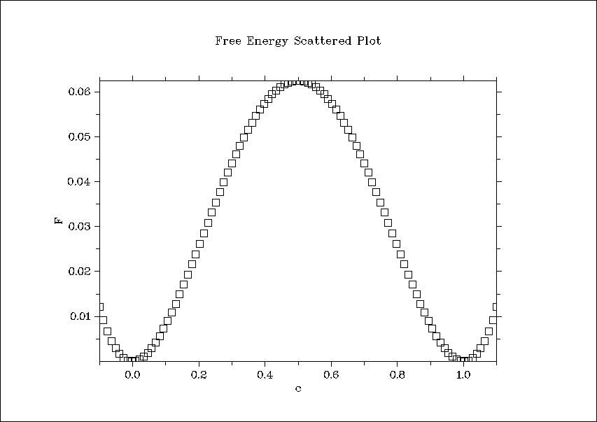
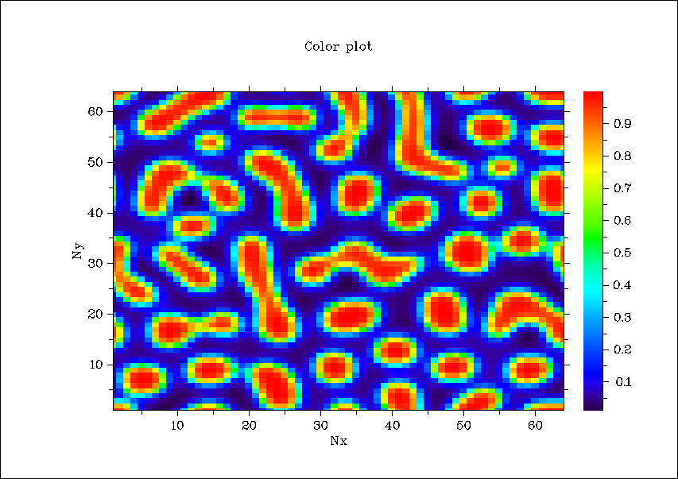
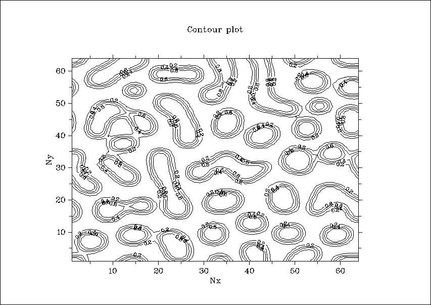
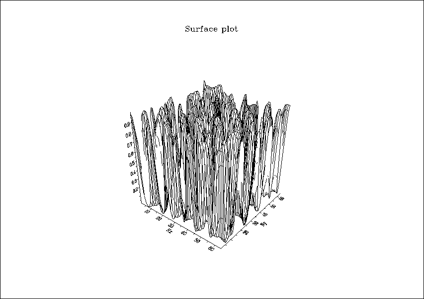
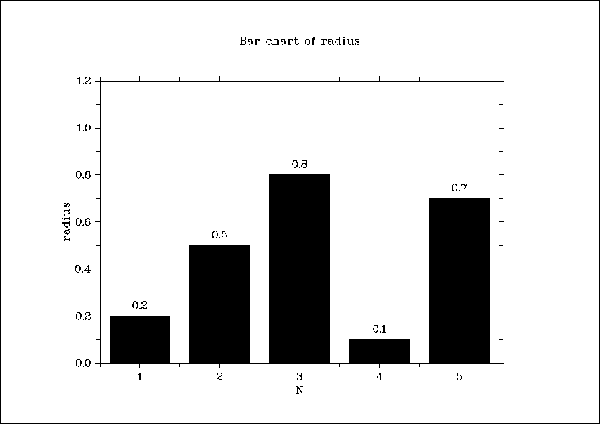
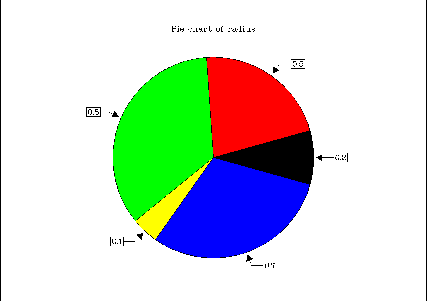

# **7 Quick plots in Fortran**

The repository demonstrates the use of **7 Quick plots**. The example code is the Cahn-Hilliard type phase field model. 

## **Prerequisites**

* [Fortran](https://github.com/Shahid718/Installation_guide) compiler

* [Dislin](https://github.com/Shahid718/Installation_guide) graphical libarary

# **Quick plot routines**

are **one statement data plotting [DISLIN](https://www.dislin.de/) routines**. 

|          Plot routines           |         Description              |    
| -------------------------------  | ---------------------------------|
|   qplot  ( X-array, Y-array, N ) |   plots data points with line    |  
|   qplsca ( X-array, Y-array, N ) |   plots data points with symbol  |
|   qplclr ( Z, Nx, Ny )           |   color plot of a matrix         |
|   qplcon ( Z, Nx, Ny, Level )    |   contour plot of a matrix       |
|   qplsur ( Z, Nx, Ny )           |   surface plot of a matrix       |
|   qplbar ( Y-array, N)           |   plots a bar graph              |
|   qplpie ( Y-array, N)           |   plots a pie chart              | 


**X-array** and **Y-array** are arrays with X and Y coordinates.

**N** is number of data points.

**Z** is a matrix with dimension (Nx,Ny).

**Nx**, **Ny** are the dimensions of **Z**.

**Level** is a number of contour levels to be generated.

**Y-array** is array of data points.

## **Compile and run**

The command for single precision is
> f90link -a main

For double precision
> f90link -a -r8 main

where **main** is the name of file **main.f90**

### **Computing platform**
The example codes are tested for

| OS          |   Compiler    |   version    | 
|-------------| ------------- | -------------|
| Windows 10  |   gfortran    |    13.2.0    |  
    

## **Output**

The default output is the console.

1. qplot  (X-array, Y-array, N )


2. qplsca (X-array, Y-array, N )


3. qplclr ( Z, Nx, Ny ) 


4. qplcon ( Z, Nx, Ny, Level )


5. qplsur ( Z, Nx, Ny )


6. qplbar ( Y-array, N) 


7. qplpie ( Y-array, N) 


# **Modified quick plots**

The second code **main_1.f90** shows the use of routines to change the default output format. They also add **axis labels** and the **title** of the plot. Note that they should be used for each quick plot.

```
  call METAFL ('png')
  call SCRMOD ('revers')
  call DISINI
  call NAME ('c', 'X')
  call NAME ('F', 'Y')
  call TITLIN ('Free Energy', 2) 
```

The above routines save the plot in **png** format and change the background to **white**. The file name is **dislin.png** by default. The next file will have **dislin_1.png** and so on. The outputs are:

1. qplot  (X-array, Y-array, N )



2. qplsca (X-array, Y-array, N )



3. qplclr ( Z, Nx, Ny ) 



4. qplcon ( Z, Nx, Ny, Level )



5. qplsur ( Z, Nx, Ny )



6. qplbar ( Y-array, N) 



7. qplpie ( Y-array, N) 




---

**Date : 7 October 2023**
